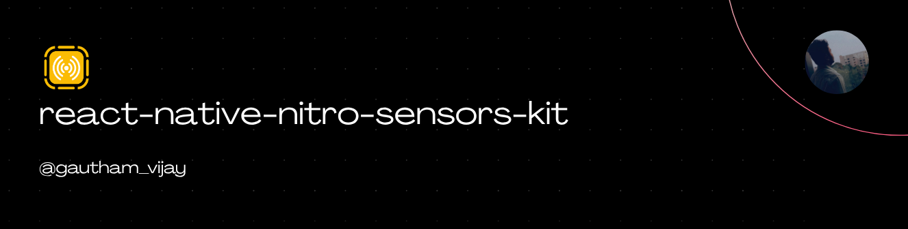

<a href="https://gauthamvijay.com">
  <picture>
    
  </picture>
</a>

# react-native-nitro-sensors-kit

A **React Native Nitro Module** providing high-performance, zero-bridge access to device sensors:

- 📐 **Accelerometer** — Raw acceleration in m/s²
- 🌀 **Gyroscope** — Angular velocity in rad/s
- 🧭 **Magnetometer** — Magnetic field strength in µT
- 🎯 **Device Motion** — OS-fused attitude, gravity, and user acceleration
- 🌤️ **Barometer** — Atmospheric pressure and relative altitude
- 🚶 **Pedometer** — Step counting, distance, pace, cadence, and floors

Built with [**Nitro Modules**](https://nitro.margelo.com) for direct JSI-powered native sensor access — no bridge, no serialization overhead.

---

> [!IMPORTANT]
>
> - Tested on React Native **0.81+** with Nitro Modules.
> - Sensors return real data on **physical devices only** — simulators/emulators return zeros or are unavailable.
> - Pedometer requires **iOS 14+** and **Android API 29+** for runtime permissions.

---

## 📦 Installation

```bash
npm install react-native-nitro-sensors-kit react-native-nitro-modules
cd ios && pod install
```

---

## Demo

<table>
  <tr>
    <th align="center">🍏 iOS Demo</th>
    <th align="center">🤖 Android Demo</th>
  </tr>
  <tr>
    <td align="center">
    
    </td>
    <td align="center">
    <div>Coming Soon!</div>
    </td>
  </tr>
</table>

---

## Configuration

### **iOS**

Add to your **`Info.plist`** (required for Pedometer only):

```xml
<key>NSMotionUsageDescription</key>
<string>This app uses motion sensors to track your steps and activity</string>
```

No setup needed for Accelerometer, Gyroscope, Magnetometer, Device Motion, or Barometer.

### **Android**

Add to your **`AndroidManifest.xml`** (required for Pedometer only):

```xml
<uses-permission android:name="android.permission.ACTIVITY_RECOGNITION" />
```

No setup needed for the other 5 sensors.

---

## 🧠 Overview

| Sensor            | iOS API           | Android API                            | Permission                                          |
| ----------------- | ----------------- | -------------------------------------- | --------------------------------------------------- |
| **Accelerometer** | `CMMotionManager` | `TYPE_ACCELEROMETER`                   | None                                                |
| **Gyroscope**     | `CMMotionManager` | `TYPE_GYROSCOPE`                       | None                                                |
| **Magnetometer**  | `CMMotionManager` | `TYPE_MAGNETIC_FIELD`                  | None                                                |
| **Device Motion** | `CMDeviceMotion`  | `TYPE_ROTATION_VECTOR` + fused sensors | None                                                |
| **Barometer**     | `CMAltimeter`     | `TYPE_PRESSURE`                        | None                                                |
| **Pedometer**     | `CMPedometer`     | `TYPE_STEP_COUNTER`                    | `NSMotionUsageDescription` / `ACTIVITY_RECOGNITION` |

---

## ⚙️ Usage

### With Hooks (Recommended)

```tsx
import React, { useState } from 'react';
import { View, Text, Button, ScrollView, StyleSheet } from 'react-native';
import {
  useAccelerometer,
  useGyroscope,
  useMagnetometer,
  useDeviceMotion,
  useBarometer,
  usePedometer,
} from 'react-native-nitro-sensors-kit';

export default function App() {
  const [active, setActive] = useState(false);

  const accel = useAccelerometer(100, active);
  const gyro = useGyroscope(100, active);
  const mag = useMagnetometer(100, active);
  const motion = useDeviceMotion(100, active);
  const baro = useBarometer(active);
  const pedo = usePedometer(active);

  return (
    <ScrollView style={styles.container}>
      <Text style={styles.title}>Nitro Sensors</Text>

      <Button
        title={active ? 'Stop All Sensors' : 'Start All Sensors'}
        onPress={() => setActive((p) => !p)}
      />

      <Text style={styles.section}>Accelerometer (m/s²)</Text>
      <Text>X: {accel.data?.x.toFixed(3)}</Text>
      <Text>Y: {accel.data?.y.toFixed(3)}</Text>
      <Text>Z: {accel.data?.z.toFixed(3)}</Text>

      <Text style={styles.section}>Gyroscope (rad/s)</Text>
      <Text>X: {gyro.data?.x.toFixed(3)}</Text>
      <Text>Y: {gyro.data?.y.toFixed(3)}</Text>
      <Text>Z: {gyro.data?.z.toFixed(3)}</Text>

      <Text style={styles.section}>Magnetometer (µT)</Text>
      <Text>X: {mag.data?.x.toFixed(3)}</Text>
      <Text>Y: {mag.data?.y.toFixed(3)}</Text>
      <Text>Z: {mag.data?.z.toFixed(3)}</Text>

      <Text style={styles.section}>Device Motion</Text>
      <Text>Pitch: {motion.data?.attitude?.pitch.toFixed(3)}</Text>
      <Text>Roll: {motion.data?.attitude?.roll.toFixed(3)}</Text>
      <Text>Yaw: {motion.data?.attitude?.yaw.toFixed(3)}</Text>

      <Text style={styles.section}>Barometer</Text>
      <Text>Pressure: {baro.data?.pressure.toFixed(1)} hPa</Text>
      <Text>Rel. Altitude: {baro.data?.relativeAltitude.toFixed(2)} m</Text>

      <Text style={styles.section}>Pedometer</Text>
      <Text>Steps: {pedo.data?.steps ?? '—'}</Text>
      <Text>Distance: {pedo.data?.distance ?? '—'} m</Text>
      <Text>Permission: {pedo.permissionStatus}</Text>
      {pedo.permissionStatus === 'notDetermined' && (
        <Button title="Request Permission" onPress={pedo.requestPermission} />
      )}
    </ScrollView>
  );
}

const styles = StyleSheet.create({
  container: { flex: 1, padding: 20 },
  title: { fontSize: 28, fontFamily: 'System', marginBottom: 16 },
  section: { fontSize: 16, fontFamily: 'System', marginTop: 16, color: '#888' },
});
```

### Direct API (No Hooks)

```ts
import { accelerometer, pedometer } from 'react-native-nitro-sensors-kit';

// Accelerometer — no permissions needed
accelerometer.interval = 50; // 50ms = 20Hz
accelerometer.onUpdate = (data) => {
  console.log(`x: ${data.x}, y: ${data.y}, z: ${data.z}`);
};
accelerometer.start();

// Pedometer — requires permission
const status = await pedometer.requestPermission();
if (status === 'granted') {
  pedometer.onUpdate = (data) => {
    console.log(`Steps: ${data.steps}, Distance: ${data.distance}m`);
  };
  pedometer.start();
}

// Query historical steps (iOS only)
const history = await pedometer.queryHistoricalData(
  Date.now() - 86400000, // 24h ago
  Date.now()
);
console.log(`Steps in last 24h: ${history.steps}`);

// Clean up
accelerometer.stop();
pedometer.stop();
```

---

## 🧩 API Reference

### Hooks

| Hook                                   | Params              | Returns                                                                                                      |
| -------------------------------------- | ------------------- | ------------------------------------------------------------------------------------------------------------ |
| `useAccelerometer(interval?, active?)` | `number`, `boolean` | `{ data, isAvailable, isActive }`                                                                            |
| `useGyroscope(interval?, active?)`     | `number`, `boolean` | `{ data, isAvailable, isActive }`                                                                            |
| `useMagnetometer(interval?, active?)`  | `number`, `boolean` | `{ data, isAvailable, isActive }`                                                                            |
| `useDeviceMotion(interval?, active?)`  | `number`, `boolean` | `{ data, isAvailable, isActive }`                                                                            |
| `useBarometer(active?)`                | `boolean`           | `{ data, isAvailable, isActive }`                                                                            |
| `usePedometer(active?)`                | `boolean`           | `{ data, isAvailable, isActive, permissionStatus, requestPermission, checkPermission, queryHistoricalData }` |

### Data Types

#### AccelerometerData / GyroscopeData / MagnetometerData

```ts
{
  x: number;
  y: number;
  z: number;
  timestamp: number;
}
```

#### DeviceMotionData

```ts
{
  attitude: {
    pitch: number;
    roll: number;
    yaw: number;
  }
  rotationRate: {
    x: number;
    y: number;
    z: number;
  }
  userAcceleration: {
    x: number;
    y: number;
    z: number;
  }
  gravity: {
    x: number;
    y: number;
    z: number;
  }
  heading: number; // degrees, -1 if unavailable
  timestamp: number;
}
```

#### BarometerData

```ts
{
  pressure: number; // hPa (mbar)
  relativeAltitude: number; // meters since start()
  timestamp: number;
}
```

#### PedometerData

```ts
{
  steps: number;
  distance: number; // meters, -1 if unavailable
  currentPace: number; // s/m, iOS only, -1 if unavailable
  currentCadence: number; // steps/s, iOS only, -1 if unavailable
  floorsAscended: number; // iOS only, -1 if unavailable
  floorsDescended: number; // iOS only, -1 if unavailable
  timestamp: number;
}
```

#### PermissionStatus

```ts
'granted' | 'denied' | 'restricted' | 'notDetermined';
```

---

## 🧩 Platform Differences

| Feature                     | iOS                     | Android                         |
| --------------------------- | ----------------------- | ------------------------------- |
| Pedometer distance          | ✅                      | ❌ (-1)                         |
| Pedometer pace/cadence      | ✅                      | ❌ (-1)                         |
| Pedometer floors            | ✅                      | ❌ (-1)                         |
| Historical step queries     | ✅ `CMPedometer`        | ❌ Not supported                |
| Barometer relative altitude | ✅ Native               | ✅ Computed from pressure delta |
| Device Motion heading       | ✅ Magnetic north       | ❌ (-1)                         |
| Device Motion fusion        | Single `CMDeviceMotion` | 4 sensors fused manually        |

---

## 🧩 Supported Platforms

| Platform                      | Status                       |
| ----------------------------- | ---------------------------- |
| **iOS (physical device)**     | ✅ Supported                 |
| **Android (physical device)** | ✅ Supported                 |
| **iOS Simulator**             | ⚠️ Most sensors return zeros |
| **Android Emulator**          | ⚠️ Most sensors unavailable  |

---

## 🤝 Contributing

PRs welcome!

- [Development Workflow](CONTRIBUTING.md#development-workflow)
- [Sending a PR](CONTRIBUTING.md#sending-a-pull-request)
- [Code of Conduct](CODE_OF_CONDUCT.md)

---

## 🪪 License

MIT © [**Gautham Vijayan**](https://gauthamvijay.com)

---

Made with ❤️ and [**Nitro Modules**](https://nitro.margelo.com)
